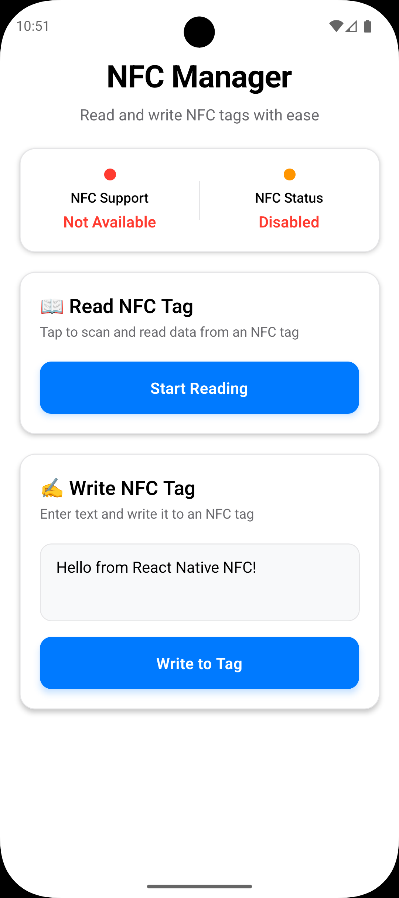
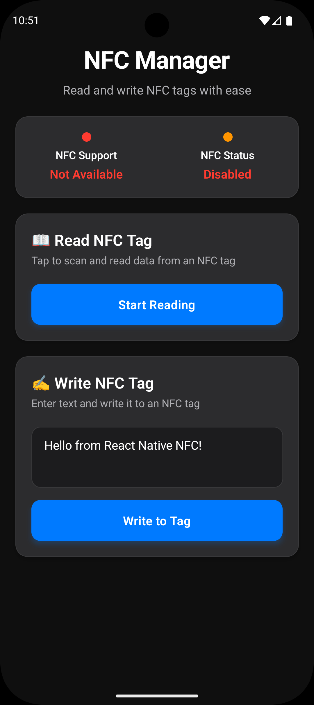

# 📱 NFC Manager

<div align="center">
  
  
  
  
</div>

<p align="center">
  <strong>A beautiful, modern NFC tag reader and writer app built with React Native</strong>
</p>

<p align="center">
  Seamlessly read from and write to NFC tags with an intuitive, aesthetically pleasing interface that supports both light and dark modes.
</p>

---

## ✨ Features

### 🎯 Core Functionality

- **📖 NFC Tag Reading** - Scan and decode NDEF data from NFC tags
- **✍️ NFC Tag Writing** - Write custom text messages to NFC tags
- **🔍 Tag Information** - View detailed tag metadata including ID, technologies, and NDEF records
- **⚡ Real-time Status** - Live NFC support and enablement detection

### 🎨 Beautiful UI/UX

- **🌓 Dark/Light Mode** - Automatic theme switching based on system preferences
- **📱 Modern Design** - Clean, card-based layout with smooth animations
- **🎯 Accessibility** - High contrast colors and readable typography
- **📊 Status Indicators** - Visual feedback with color-coded status dots
- **💫 Smooth Interactions** - Responsive touch feedback and transitions

### 🛠️ Technical Features

- **TypeScript** - Full type safety and better developer experience
- **Error Handling** - Comprehensive error handling and user feedback
- **Performance** - Optimized for smooth performance and battery efficiency

---

## 📱 Screenshots

<div align="center">
  
  
</div>

---

## 🚀 Quick Start

### Prerequisites

- Node.js (v16 or higher)
- React Native CLI
- Android Studio
- Physical device with NFC capability (NFC doesn't work on simulators)

### Installation

1. **Clone the repository**

   ```bash
   git clone https://github.com/atharvdange618/nfc-manager-app.git
   cd nfc-manager-app
   ```

2. **Install dependencies**

   ```bash
   npm install
   # or
   yarn install
   ```

3. **Run the app**

   ```bash
   npx react-native run-android
   ```

---

## 📦 Dependencies

### Core Dependencies

- `react-native` - The React Native framework
- `react-native-nfc-manager` - NFC functionality for React Native
- `@types/react` - TypeScript definitions for React
- `@types/react-native` - TypeScript definitions for React Native

### Key Libraries

```json
{
  "react": "19.1.0",
  "react-native": "0.80.0",
  "react-native-nfc-manager": "^3.16.1"
}
```

---

## 🏗️ Project Structure

```merlin
nfc-manager-app/
├── 📁 src/
│   ├── 📁 components/
│   │   └── App.tsx                 # Main app component
│   ├── 📁 utils/
│       └── withNdef.ts            # NFC utility functions
├── 📁 android/                    # Android-specific files
├── 📁 ios/                       # iOS-specific files
├── 📄 package.json
├── 📄 tsconfig.json
└── 📄 README.md
```

---

## 🎯 Usage

### Reading NFC Tags

1. **Ensure NFC is enabled** on your device
2. **Tap "Start Reading"** button
3. **Bring your device close** to an NFC tag
4. **View the results** in the tag information section

### Writing to NFC Tags

1. **Enter your text** in the input field
2. **Tap "Write to Tag"** button
3. **Approach the NFC tag** with your device
4. **Confirmation message** will appear when writing is complete

### Tag Information

The app displays comprehensive information about scanned tags:

- **Tag ID** - Unique identifier
- **Technologies** - Supported NFC technologies
- **NDEF Records** - Structured data content
- **Raw Payload** - Hex representation of data

---

## 🔧 Configuration

Add these permissions to your `android/app/src/main/AndroidManifest.xml`:

```xml
<uses-permission android:name="android.permission.NFC" />
<uses-feature
    android:name="android.hardware.nfc"
    android:required="true" />
```

---

## 🎨 Customization

### Theme Configuration

The app uses a comprehensive theme system that automatically adapts to system preferences:

```typescript
const theme = {
  background: isDarkMode ? "#0F0F0F" : "#FFFFFF",
  surface: isDarkMode ? "#1C1C1E" : "#F8F9FA",
  primary: "#007AFF",
  success: "#34C759",
  // ... more theme properties
};
```

### Styling

All styles are defined using `StyleSheet.create()` with responsive design principles:

```typescript
const styles = StyleSheet.create({
  card: {
    borderRadius: 16,
    padding: 20,
    shadowColor: "#000",
    shadowOffset: { width: 0, height: 2 },
    shadowOpacity: 0.05,
    shadowRadius: 8,
    elevation: 3,
  },
  // ... more styles
});
```

---

## 🧪 Testing

### Device Requirements

- **Physical device** with NFC capability
- **NFC tags** for testing (NTAG213, NTAG215, or NTAG216 recommended)
- **NFC enabled** in device settings

### Testing Checklist

- [ ] NFC detection works correctly
- [ ] Reading various tag types
- [ ] Writing text to tags
- [ ] Error handling for disabled NFC
- [ ] Dark/light mode switching
- [ ] UI responsiveness on different screen sizes

---

## 📈 Performance

### Optimization Features

- **Lazy loading** of NFC operations
- **Efficient re-renders** with React hooks
- **Memory management** for tag data
- **Battery optimization** with proper NFC session management

### Best Practices

- Always call `NfcManager.start()` on app initialization
- Properly handle NFC session cleanup
- Use `useCallback` for event handlers
- Implement proper error boundaries

---

## 🔒 Security

### Data Protection

- **No sensitive data storage** - All operations are session-based
- **Secure NFC operations** - Using official react-native-nfc-manager
- **Input validation** - Proper validation of user input before writing
- **Error handling** - Comprehensive error handling prevents crashes

### Privacy

- **No data collection** - The app doesn't collect or transmit user data
- **Local operations only** - All NFC operations happen locally on device
- **No network requests** - Fully offline functionality

---

## 🤝 Contributing

We welcome contributions! Please follow these steps:

1. **Fork the repository**
2. **Create a feature branch**: `git checkout -b feature/amazing-feature`
3. **Commit your changes**: `git commit -m 'Add amazing feature'`
4. **Push to the branch**: `git push origin feature/amazing-feature`
5. **Open a Pull Request**

### Development Guidelines

- Follow TypeScript best practices
- Maintain consistent code formatting
- Write meaningful commit messages
- Test on Android
- Update documentation as needed

---

## 📝 License

This project is licensed under the MIT License.

---

## 🙏 Acknowledgments

- **react-native-nfc-manager** - For providing excellent NFC functionality
- **React Native Community** - For the amazing framework and ecosystem
- **NFC Forum** - For NFC standards and specifications

---

## 📞 Support

### Getting Help

- **📚 Documentation** - Check this README and code comments
- **🐛 Issues** - Report bugs via GitHub Issues
- **📧 Email** - Contact us at atharvdange.dev@gmail.com

### Common Issues

- **NFC not working on simulator** - Use a physical device
- **Permission denied** - Check NFC permissions in device settings
- **App crashes on tag read** - Ensure NFC is enabled and try again

---

<div align="center">
  <p>
    <strong>Made with ❤️ by a developer who loves NFC technology</strong>
  </p>
  <p>
    <a href="https://github.com/atharvdange618/nfc-manager-app">⭐ Star this project</a> •
    <a href="https://github.com/atharvdange618/nfc-manager-app/issues">🐛 Report Bug</a> •
    <a href="https://github.com/atharvdange618/nfc-manager-app/issues">💡 Request Feature</a>
  </p>
</div>
